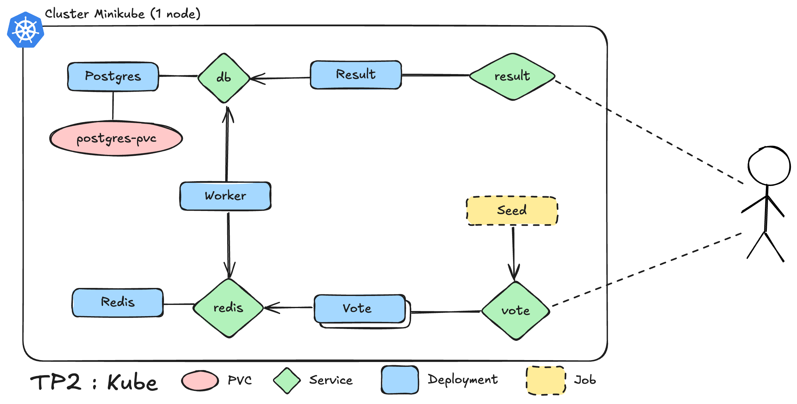

# DevOps TP Series

Ce projet est une série de travaux pratiques sur DevOps, couvrant Docker, Kubernetes et Ansible. Chaque TP construit sur les connaissances acquises dans les précédents.

## Table des matières
- [TP Docker](#tp-docker)
- [TP Kubernetes](#tp-kubernetes)
- [TP Kubernetes + Ansible](#tp-kubernetes--ansible)

## TP Docker

### Objectifs
- Déploiement d'une application multi-services avec Docker Compose
- Création d'images Docker optimisées pour différents langages
- Utilisation de volumes pour la persistance des données

### Architecture
L'application est composée de plusieurs services, chacun dans un langage différent, communiquant entre eux via Docker Compose.


### Démarrage rapide

1. Naviguer vers le répertoire du projet :
```shell
cd tp_docker
```

2. Lancer l'application (cela construit les images et les démarre) :
```shell
docker-compose up -d
```

## TP Kubernetes

### Objectifs
- Migration des conteneurs Docker vers Kubernetes
- Configuration des services pour l'exposition des applications
- Gestion des environnements avec Kustomize

### Architecture
Les services sont maintenant orchestrés par Kubernetes, avec une gestion des environnements de développement et de production.



### Démarrage rapide

1. Naviguer vers le répertoire du projet :
```shell
cd tp_kube
```

2. Construire les images dans Minikube :
```shell
minikube image build -t vote-app/seed ./seed-data
minikube image build -t vote-app/result ./result
minikube image build -t vote-app/nginx ./nginx
minikube image build -t vote-app/vote ./vote
minikube image build -t vote-app/worker ./worker
```

3. Déployer les environnements :
```shell
# Environnement de production
kubectl apply -k k8s/overlays/production

# Environnement de développement
kubectl apply -k k8s/overlays/dev01
```

4. Accéder aux bases de données :
```shell
# Production (port 5432)
kubectl port-forward -n production svc/db 5432:5432

# Développement (port 5433)
kubectl port-forward -n dev01 svc/db 5433:5432
```

## TP Kubernetes + Ansible

### Objectifs
- Automatisation de la configuration des VMs avec Ansible
- Mise en place d'une base de données PostgreSQL répliquée
- Intégration avec l'infrastructure Kubernetes existante

### Architecture
Les bases de données sont maintenant hébergées sur des VMs dédiées avec réplication, remplaçant les instances précédentes.


### Démarrage rapide

1. Naviguer vers le répertoire du projet :
```shell
cd tp_ansible
```

2. Configurer les VMs et déployer les bases de données :
```shell
ansible-playbook deploy_postgres.yml
```

3. Backup de la base de données :
```shell
ansible-playbook pg_backup.yml
# Ou
ansible-playbook pg_backup_v2.yml
```

4. Replication de la base de données :
```shell
ansible-playbook pg_replica.yml
```

### Utilisation de kustomize

```shell
kubectl apply -k k8s/overlays/production
```

```shell
kubectl apply -k k8s/overlays/dev01
```

Nous avons utilisé Kustomize pour gérer des configurations Kubernetes différentes pour simuler plusieurs environnements.

Dans base nous avons le déploiement des applications.

Dans overlays dev01 nous ajoutons le déploiement d'une base de données interne au cluster PostgreSQL 
avec un PVC interne au cluster. 

Dans overlays production nous utilisons EndpointSlice pour utiliser la base de données externe crée avec Ansible. Et nous ajoutons un Horizontal Pod AutoScaler pour mutliplier le nombre de pod du service vote.


## Prérequis

- Docker et Docker Compose
- Kubernetes (Minikube)
- Ansible
- PostgreSQL
