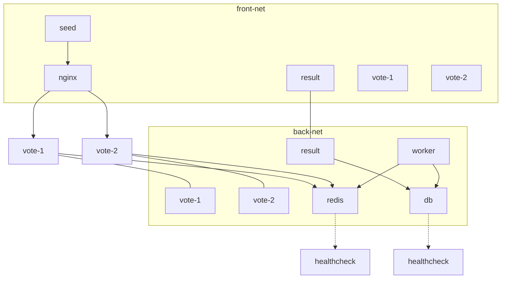

# TP docker

```mermaid
graph TD
  subgraph front-net
    seed[seed]
    result_front[result]
    nginx[nginx]
    vote1[vote-1]
    vote2[vote-2]
  end

  subgraph back-net
    result_back[result]
    vote1_back[vote-1]
    vote2_back[vote-2]
    worker[worker]
    redis[redis]
    db[db]
  end

  seed --> nginx
  nginx --> vote-1
  nginx --> vote-2
  
  vote-1 --> redis
  vote-2 --> redis
  
  result_back --> db
  worker --> redis
  worker --> db

  redis -.-> redisHealth[healthcheck]
  db -.-> dbHealth[healthcheck]

  result_front --- result_back
  vote-1 --- vote1_back
  vote-2 --- vote2_back
```